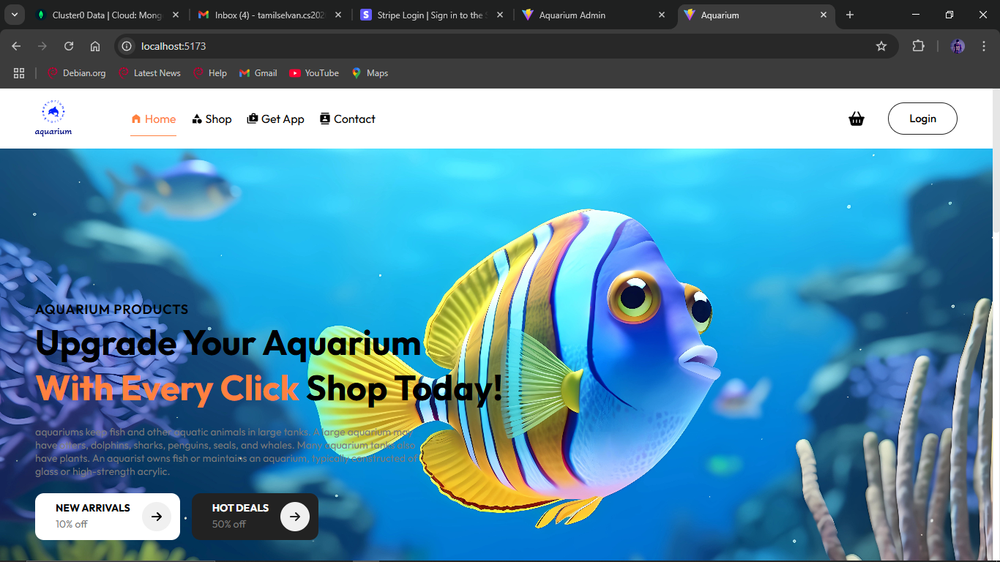

# MERN Stack E-commerce Application

## 📌 Project Overview
This is a full-stack e-commerce application built using the **MERN (MongoDB, Express.js, React.js, Node.js) stack**. The platform allows users to browse products, add them to the cart, and complete purchases using a secure **Stripe payment gateway**. It also features **role-based authentication**, enabling admins to manage products and orders.

## 🛠️ Tech Stack
- **Frontend**: React.js, Redux, Tailwind CSS
- **Backend**: Node.js, Express.js
- **Database**: MongoDB
- **Authentication**: JWT (JSON Web Tokens)
- **Payment Gateway**: Stripe API
- **Deployment**: (Add your deployment details if applicable, e.g., Vercel, Heroku, AWS)

## ✨ Features
- User authentication (Register/Login) with JWT
- Role-based access control (Admin/User)
- Product catalog with detailed views
- Add to cart & manage cart items
- Secure online payments via Stripe
- Order management for users and admins
- RESTful API design and optimization
- Responsive and mobile-friendly UI

## 🚀 Installation & Setup

### 1️⃣ Clone the repository
```sh
git clone https://github.com/your-username/mern-ecommerce.git
cd mern-ecommerce
```

### 2️⃣ Install dependencies
#### Backend
```sh
cd backend
npm install
```
#### Frontend
```sh
cd frontend
npm install
```

### 3️⃣ Set up environment variables
Create a **.env** file in the **backend** folder and add:
```env
MONGO_URI=your_mongodb_connection_string
JWT_SECRET=your_secret_key
STRIPE_SECRET_KEY=your_stripe_secret_key
```

### 4️⃣ Run the application
#### Backend (Port: 5000)
```sh
cd backend
npm start
```
#### Frontend (Port: 3000)
```sh
cd frontend
npm start
```

## 📸 Screenshots


## 🛡️ Security Considerations
- Environment variables for sensitive data
- Secure authentication with JWT
- Role-based access control for admin features

## 🏗️ Future Enhancements
- Wishlist functionality
- Product reviews & ratings
- Order tracking system
- AI-based product recommendations

## 🏆 Contributions
Feel free to fork this repository and submit pull requests. Suggestions and contributions are always welcome!

## 📩 Contact
For any queries or collaborations, reach out at [stamilselvan762@gmail.com].


